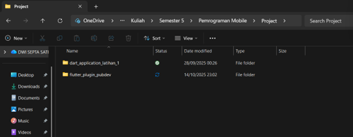
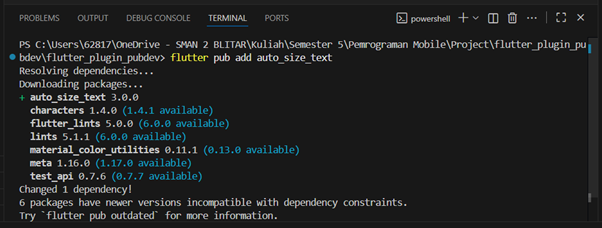
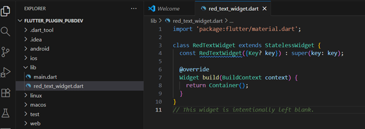
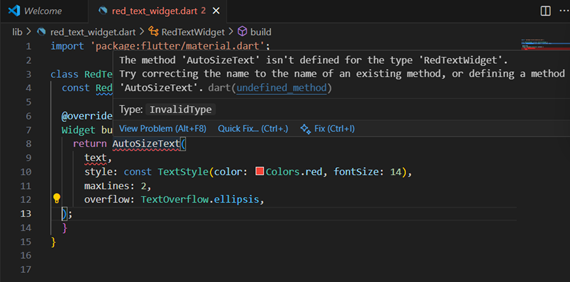
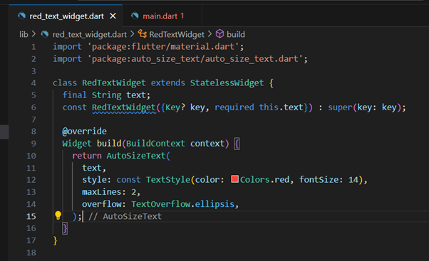
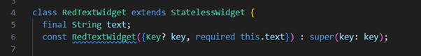
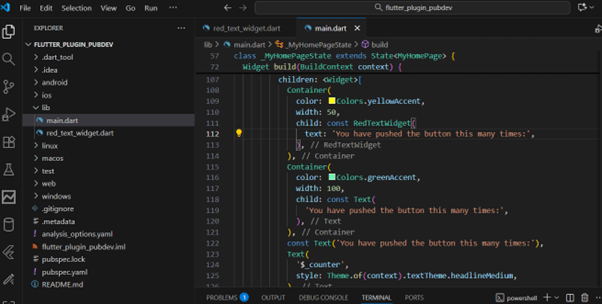
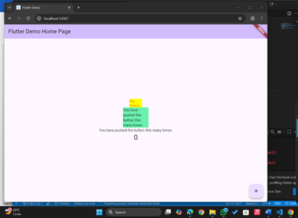
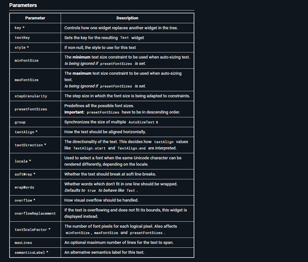

1. Buat Project Baru

Buat project Flutter baru dengan nama `flutter_plugin_pubdev`.  
Kemudian jadikan repository di GitHub dengan nama flutter_plugin_pubdev.



---

2. Menambahkan Plugin

Tambahkan plugin `auto_size_text` menggunakan perintah berikut di terminal:

```bash
flutter pub add auto_size_text
```

Jika berhasil, nama plugin dan versinya akan muncul di file `pubspec.yaml` pada bagian `dependencies`.


---

3. Membuat File `red_text_widget.dart`

Buat file baru bernama `red_text_widget.dart` di dalam folder `lib`, lalu isi dengan kode berikut:

```dart
import 'package:flutter/material.dart';

class RedTextWidget extends StatelessWidget {
  const RedTextWidget({Key? key}) : super(key: key);

  @override
  Widget build(BuildContext context) {
    return Container();
  }
}
```



---

4. Menambahkan Widget AutoSizeText

Masih di file `red_text_widget.dart`, ubah kode `return Container();` menjadi:

```dart
return const AutoSizeText(
  'Contoh teks yang menyesuaikan ukuran font',
  style: TextStyle(color: Colors.red),
  maxLines: 2,
);
```

Namun, setelah menambahkan kode di atas akan muncul error:



```
The method 'AutoSizeText' isn't defined for the type 'RedTextWidget'.
```

Penjelasan:
Error tersebut muncul karena widget `AutoSizeText` digunakan tanpa mengimpor package yang berisi widget tersebut.  
Solusinya, tambahkan import berikut di atas file:

```dart
import 'package:auto_size_text/auto_size_text.dart';
```




---

5. Menambahkan Variabel `text` dan Parameter Constructor

Tambahkan variabel `text` dan parameter di constructor agar widget lebih fleksibel.

```dart
class RedTextWidget extends StatelessWidget {
  final String text;

  const RedTextWidget({Key? key, required this.text}) : super(key: key);

  @override
  Widget build(BuildContext context) {
    return AutoSizeText(
      text,
      style: const TextStyle(color: Colors.red),
      maxLines: 2,
    );
  }
}
```



---

6. Tambahkan Widget di `main.dart`

Tambahkan widget di dalam `children:` pada class `_MyHomePageState`:



```dart
RedTextWidget(text: 'Teks Merah Otomatis'),
```

Kemudian jalankan aplikasi dengan menekan **F5**.




---

Hasil dan Analisis

Widget `RedTextWidget` digunakan untuk menampilkan teks pendek atau menengah yang otomatis menyesuaikan ukuran font agar tetap muat dalam dua baris, dengan warna merah.  

Widget 1 (RedTextWidget):
- Menggunakan `AutoSizeText`
- Warna teks merah
- Lebar container 50 piksel, background kuning  
- Teks menyesuaikan ukuran font

Widget 2 (Text standar):
- Menggunakan widget `Text`
- Warna teks default
- Lebar container 100 piksel, background hijau  
- Ukuran font tetap




---

Penjelasan Parameter pada AutoSizeText

| Parameter | Deskripsi |
|------------|------------|
| `text` | Teks yang akan ditampilkan oleh widget |
| `style` | Mengatur tampilan teks seperti warna, ukuran font, ketebalan |
| `maxLines` | Jumlah maksimum baris yang ditampilkan |
| `overflow` | Menentukan cara teks yang melebihi batas baris akan ditangani |

